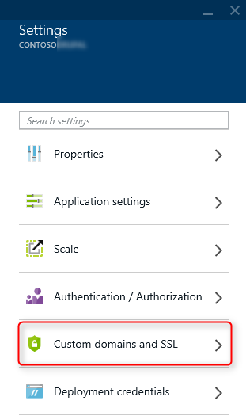
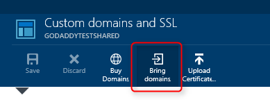
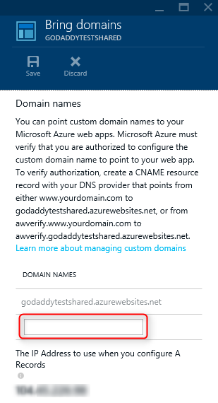

If you don't have a domain, you can buy domains on [Azure Management Portal](https://portal.azure.com) directly. Use the following steps to buy the domain names and assign to your Web App.

1. In your browser, open the [Azure Management Portal](https://portal.azure.com).

2. In the **Web Apps** tab, click the name of your web app, select **Settings**, and then select **Custom domains and SSL**

	

3. In the **Custom domains and SSL** blade, click **Bring domains**.

	

4. Use the **DOMAIN NAMES** text boxes to enter the domain names to associate with this website.

	

6. Click **Save** to save the domain name configuration.

	Once configuration has completed, the custom domain name will be listed in the **domain names** section of your website.

At this point, you should be able to enter the custom domain name in your browser and see that it successfully takes you to your Azure Website.
